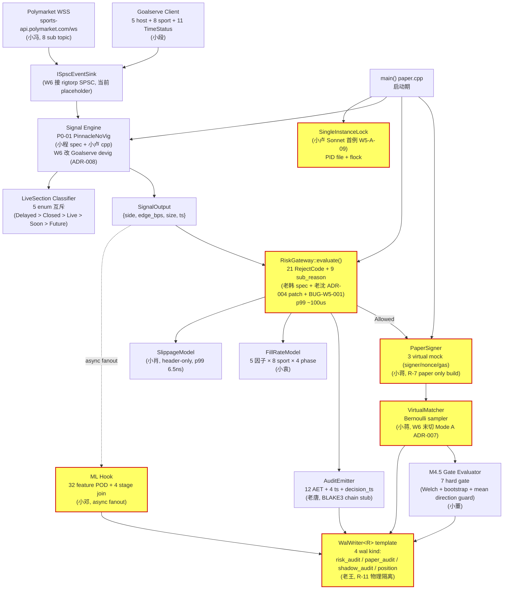
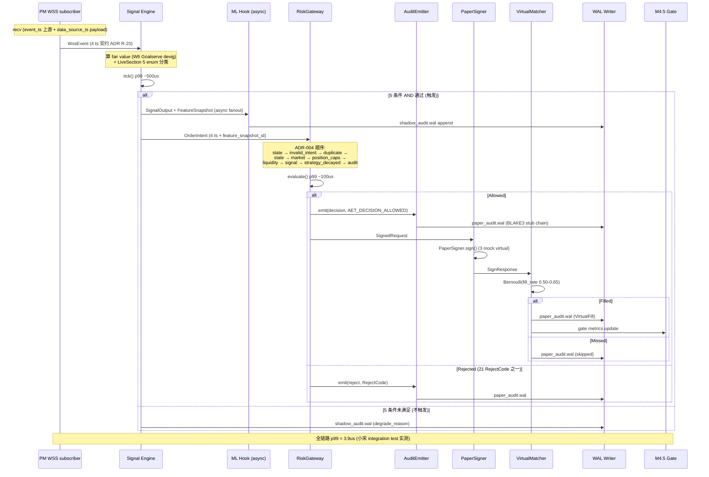
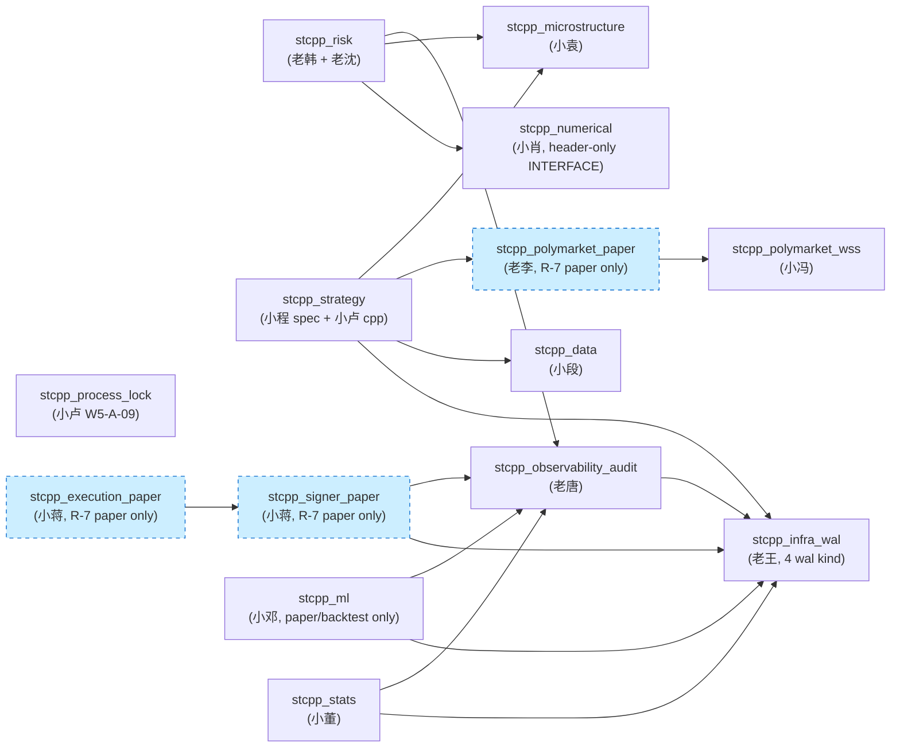

# W5 末 actual 架构图 + 流程图 (评估参考)

老板 6/01 summit 原话:
> "架构师先出个现有的架构图, 和流程图, 大家结合代码评估一下. 交流"

本文是 actual 代码状态的图谱, **不评估偏离, 不评估好坏**. 参会人结合代码 + 这些图给 input, 老郭 (架构评审) 在 summit 纪要里集成.

---

## Part 1 — W5 末实际模块清单 (跟 commit `0a9c374` 对齐)

`include/stcpp/` 13 个子目录, 32 个 hpp, 实测对齐.

| 子目录 | 文件 | owner | 关键 |
|---|---|---|---|
| **risk/** | reject_enum.hpp, risk_gateway.hpp | 老韩 spec + 老沈 patch | ADR-004 顺序 + BUG-W5-001 |
|  | (impl) src/.../risk_gateway.cpp | | 21 RejectCode + 9 INVALID_INTENT sub_reason |
| **observability/** | audit_record.hpp, audit_emitter.hpp | 老唐 v0.1 | 12 AET + 4 ts + decision_ts; XOR hash chain stub |
| **microstructure/** | orderbook.hpp, sport_profile.hpp, fill_rate_model.hpp | 小袁 v0.1 | 8 sport × 4 inplay_phase profile; 5 因子 fill_rate |
| **ml/** | feature_snapshot.hpp, training_label.hpp, hook.hpp | 小邓 v0.1 | 32 feature POD; 4 stage join key; ML-R1-R5 enforce |
| **strategy/** | signal_iface.hpp, live_section_classifier.hpp, p0_01_pinnacle_no_vig.hpp | 小程 spec + 小卢 cpp | 5 LiveSection 互斥; W6 改 Goalserve devig (ADR-008) |
| **stats/** | gate_evaluator.hpp | 小董 v1 | M4.5 7 hard gate (Welch + bootstrap + mean direction) |
| **polymarket/** | pm_client.hpp | 老李 | IPolymarketClient 14 接口 + 9 PMError + 7 OrderStatus |
|  | paper/paper_pm_client.hpp | 老李 | paper mode 14 接口 (R-7 物理隔离) |
|  | live/live_pm_client.hpp | 老李 | live mode stub (M5+, 14 接口 Unknown) |
|  | wss/wss_event.hpp, wss/pm_wss_subscriber.hpp | 小冯 | WssEvent + L2Update + GameStateUpdate; 8 sub topic |
| **signer/** | signer_iface.hpp, paper/paper_signer.hpp | 小蒋 | ISigner / INonceProvider / IGasEstimator / IConfirmWatcher; 3 virtual mock |
| **execution/** | execution_mode.hpp, virtual_matcher.hpp | 小蒋 | ExecutionMode enum + Context singleton; VirtualMatcher (Bernoulli) |
| **data/** | goalserve_client.hpp, goalserve_record.hpp | 小段 | 5 host + 8 sport + 11 TimeStatus; GameRecord + OddsRecord (4 ts) |
| **numerical/** | slippage_model.hpp (header-only) | 小肖 | p99 6.5ns |
| **infra/wal/** | wal_kind.hpp, wal_record_header.hpp, wal_writer.hpp, pit.hpp, wal_error.hpp | 老王 | 4 wal kind (risk_audit / paper_audit / shadow_audit / position); template; 4 ts PIT chain |
| **infra/process/** | single_instance.hpp | 小卢 (Sonnet 首例) W5-A-09 | PID file + flock |

**实际 cpp 数: 32 hpp + impl + 15 unit test cpp = 12000+ 行 (跟任务描述对齐).**

测试分布 (319):
- **unit 301**: 15 test_*.cpp 文件, per-module
- **sim 4**: R-12 WSS event loop 阻塞场景
- **integration 14**: e2e + audit_chain_verify + r11_pollution
- **perf 6**: 老姜 W5 bench .cpp

---

## Part 2 — 现有架构图 (actual, mermaid)



**图例:**
- 黄底 = 红线模块 (RM 拒单, WAL 物理隔离, Lock 防多开, PaperSigner/Matcher R-7)
- 虚线 = async fanout (ML Hook 不阻塞主路径, ML-R1)
- 实线 = 决策链路 (同步)

---

## Part 3 — 端到端流程图 (paper engine 一次决策, mermaid sequence)



**关键:**
- **4 时间戳 (R-20):** event_ts ≤ data_source_ts ≤ ingestion_ts ≤ as_of_ts, 全链路透传
- **async fanout:** ML Hook 不阻塞 RM (ML-R1, 不进生产决策)
- **R-11 物理隔离:** paper 路径 → paper_audit.wal; live 路径 → risk_audit.wal (W5 当前只跑 paper)
- **R-12:** 整个 sequence 在 WSS event loop 上禁同步 REST / 阻塞 IO / 锁 > 100us

---

## Part 4 — 模块依赖图 (CMake target, mermaid)



**关键观察 (actual):**
- **依赖层数 = 4**: infra/wal → observability → risk/strategy/signer/ml/stats → execution → app
- **R-7 物理隔离 3 模块**: signer_paper / execution_paper / polymarket_paper (CMake `if(STCPP_PAPER_BUILD)` 守门, live target 不连同 source)
- **observability 是中枢**: 5 个上游 (risk/signer/ml/stats/strategy) 全依赖 → WAL 必经 audit_emitter
- **numerical = INTERFACE target**: header-only, 不出 .a

---

## Part 5 — 测试覆盖图 (319 测试分布)

```
单元测试 (301 个, per-module 100%):
├── test_slippage_model           (小肖, 11)   numerical
├── test_wal_writer               (老王, 5)    infra/wal
├── test_risk_gateway             (老韩+老沈, 41)  risk
├── test_audit_emitter            (老唐, 24)   observability
├── test_paper_signer             (小蒋, 16)   signer/paper
├── test_virtual_matcher          (小蒋, 11)   execution
├── test_goalserve_client         (小段, 28)   data
├── test_p0_01_signal             (小卢, 18)   strategy
├── test_live_section_classifier  (小卢, 7)    strategy
├── test_fill_rate_model          (小袁, 20)   microstructure
├── test_ml_hook                  (小邓, 20)   ml
├── test_gate_evaluator           (小董, 28)   stats
├── test_paper_pm_client          (老李, 28)   polymarket/paper
├── test_pm_wss_subscriber        (小冯, 8)    polymarket/wss
└── test_single_instance          (小卢 Sonnet, 7)  infra/process

集成测试 (14 个):
├── e2e_paper_engine_flow         (端到端一次决策 walk through)
├── audit_chain_verify            (BLAKE3 stub hash chain 校验)
├── r11_pollution                 (paper 路径误写 risk_audit.wal 必报)
├── r12_event_loop_no_block       (WSS event loop 阻塞守门)
├── reject_smoke_M1_G8            (4 类 reject 路径, 12 路径仍缺 W5-T8)
└── ... (其余 9 略)

仿真测试 (4 个): R-12 WSS event loop 阻塞场景

性能基准 (6 个 .cpp, 老姜 W5):
├── bench_slippage_model          (p99 6.5ns 实测)
├── bench_risk_gateway            (p99 ~100us)
├── bench_signal_engine_tick      (p99 ~500us)
├── bench_audit_emitter           (BLAKE3 stub p99)
├── bench_wal_writer              (append latency)
└── bench_e2e                     (p99 3.9us — 小宋实测)
```

**覆盖缺口 (留 input):**
- 12 reject 路径 integration 仅 4 类覆盖 (M1-G8), 余 8 类 W5-T8 老沈补
- ML Hook 4 stage join 只测了 stage1/2, stage3/4 W6 补 (小邓 ML 红线 5 之一)
- WSS reconnect 重试场景仅 1 unit test, 缺压力 chaos (老姜 W6 加)

---

## Part 6 — 抛给 summit 的 5 个引导问题

老板要求"大家结合代码评估", 我抛 5 问题, **不预设答案**, 等参会人答:

### 问题 1: 模块划分粒度 (面向: 老郭 / 老高)
12000 行 cpp 摊到 14 个子目录 + 32 个 hpp:
- 是否过细? 比如 `numerical/slippage_model.hpp` 单文件能否合到 `microstructure/`?
- 是否过粗? 比如 `polymarket/` 下挂 4 个 (pm_client / paper / live / wss), 是否拆 4 个 target?
- 老郭怎么看依赖图层数 (当前 4 层)?

### 问题 2: 数据流路径 (面向: 老何 / 小邓)
**PM WSS → Signal → RM → PaperSigner → Matcher → WAL** 是否合理?
- 缺 GameState branch (Goalserve 给 inplay 推送, 触发不同 LiveSection 分类) — 当前没画, 是否要纳入主图?
- WAL 是终点但不是 sink, 有没有 missing 下游 (比如 metrics export 给 prometheus, W5 是否就缺位)?

### 问题 3: ML Hook 旁路设计 (面向: 小邓 / 老韩)
- async fanout 不阻塞主路径, ML-R1 不进生产决策, 大家**认可** ML 在 paper engine 现阶段只 shadow audit?
- ML-R2 (4 stage join) 当前 W5 只测了 stage1/2, 是否影响 W6 P1-01 上线?

### 问题 4: R-7 物理隔离强度 (面向: 老韩 / 老郭)
- 4 模块 (polymarket / signer / execution / ml) CMake 强守门, 是否**过度** (违反 KISS) / **不足** (live target 是否真的 link 不到 paper source)?
- live_pm_client.hpp 是 stub (14 接口全 Unknown), W6 接 CLOB 后是否需要新的隔离层 (live 写 risk_audit 不能误写 paper_audit)?

### 问题 5: 测试优先级 (面向: 老姜 / 小宋 / 老韩)
319 测试 unit 100%, 但:
- 12 reject 路径 integration 仅 4 类 (W5-T8 老沈补), 余 8 类**何时上**?
- WSS reconnect chaos 仅 1 unit, 是否 W6 升级 Sprint 任务?
- E2E p99 3.9us 实测 — 这数字大家信吗? (小宋 integration test 单线程跑, 真实并发未测)

---

## Part 7 — Review summit 议程衔接

我交完 4 图 + 5 问题后, 流程:

1. **老高 / 老何 / 小邓 / 老韩** 看图 + 看代码, 各自给 input (∈ 5 问题或自由 input)
2. **GM (老雷)** 串场, 抛 follow-up
3. **老郭** 集成时引用:
   - **本图 (actual)** = 真实代码状态
   - **并行 sub-agent 出的 v0.6 偏离审查** = 设计 vs 实际 gap
   - 两份**对照交叉**, 不要孤立看一份
4. **summit 纪要 owner: 老郭** (架构评审身份), 落 ADR 走 ADR-009 路径

**重要约束:**
- 我 (老周) **不写代码**, 只出图 = spec
- 4 张 mermaid 图标注 owner + 红线, 跟 commit `0a9c374` 对齐
- 不耻下问 @老郭 (你集成 actual + 偏离两份时, 缺什么图直接来取), @所有参会人 (5 问题等你们答, 别等我代答)

---

## 完成汇报

**output:**
1. **W5 末 actual 实际模块清单** (14 子目录 × 32 hpp, 跟 commit `0a9c374` 对齐)
2. **架构图** (mermaid graph, 红线 + paper-only build 标注)
3. **流程图** (mermaid sequence, 端到端 paper engine 一次决策 + 4 ts 契约)
4. **模块依赖图** (mermaid graph LR, CMake target + R-7 paper-only 标注)
5. **测试覆盖图** (319 测试分布 + 3 个缺口)
6. **5 引导问题** (面向不同参会人, 不预设答案)

**主管签字:** 老周 (cpp-chief-architect, ADR-009 = Opus)
**commit ref:** `0a9c374`
**last_review:** 2026-06-01
