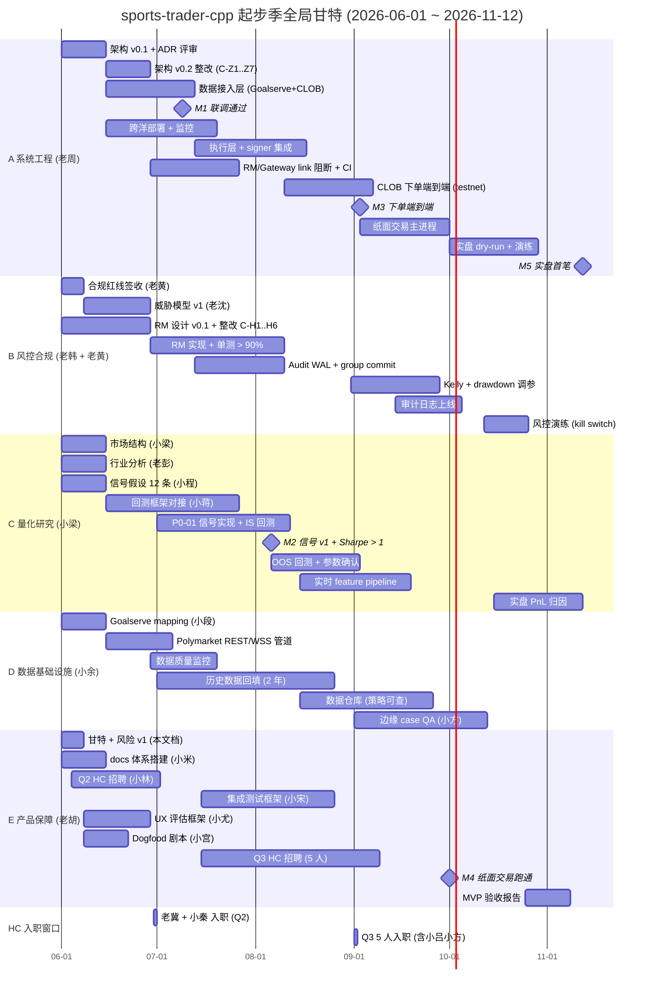
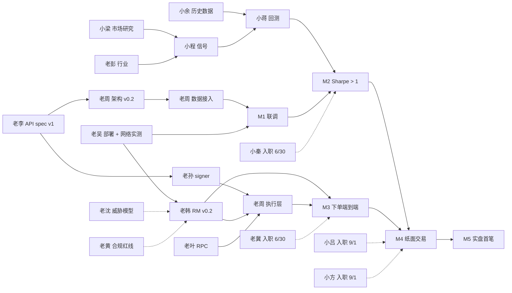

# 全局甘特图 v1

- Owner: 老胡 (pm-project-manager)
- Last review: 2026-05-28
- 验收人: 老雷
- 关联 ticket: S1-014
- 关联文档:
  - `docs/OKR/2026-Q2-Q3-startup-season.md` (起步季 OKR + M1~M5)
  - `docs/SPRINTS/sprint-01.md` (Sprint-1 26 个 ticket)
  - `docs/ADR/2026-05-28-arch-and-rm-v0.1-review.md` (老郭整改 13 项)
  - `docs/HIRING/backlog.md` (HC 节奏 Q2 2 + Q3 5)
  - `docs/RESEARCH/laohu-risk-registry-v1.md` (姊妹文档, 风险登记 v1)

---

## 0. TL;DR

- **时间轴:** T0 = 2026-06-01 (Sprint-1 启动), T+24 = 2026-11-12 (M5 MVP 实盘)
- **节奏:** 12 个 Sprint, 每 2 周一次; M1=W6, M2=W10, M3=W14, M4=W18, M5=W24
- **关键路径** (任何一环延 1 周, M5 顺延 1 周):
  ADR 整改 (W1) → 数据接入联调 (W6, M1) → RM 落地 (W12) → 信号 v1 + 回测 (W14, M2) → CLOB 下单端到端 (W14, M3) → 纸面交易 (W18, M4) → 实盘首笔 (W24, M5)
- **HC 关键依赖:** 老冀 7/1 入职 → M3 链上运维就位; 小秦 7/1 入职 → M2 信号-执行中间层就位; 小吕 + 小方 9/1 入职 → M4 纸面交易就位
- **缓冲:** M1-M3 各留 1 周缓冲, M4-M5 共留 2 周缓冲, 全期总缓冲 5 周

---

## 1. 甘特图 (M1 ~ M5)

### 1.1 时间表对齐

| 周次 | 日期范围 | Sprint | 关键节点 |
|---|---|---|---|
| W1 | 06-01 ~ 06-12 | Sprint-1 (启动) | S1 26 ticket 启动, ADR 评审, JD 发布 |
| W2 | 06-13 ~ 06-26 | Sprint-2 | 老周 v0.2 / 老韩 v0.2, ADR 整改 13 项落地, S1-021 网络实测 |
| W3 | 06-27 ~ 07-10 | Sprint-3 | 数据接入联调启动 (Goalserve + CLOB/WSS) |
| W4 | 07-11 ~ 07-24 | Sprint-4 | **M1 (07-09): 架构 v1 + 数据接入联调** |
| W5 | 07-25 ~ 08-07 | Sprint-5 | 信号 v1 草稿, 回测框架对接 |
| W6 | 08-08 ~ 08-21 | Sprint-6 | **M2 (08-06): 信号 v1 + 回测 Sharpe > 1** |
| W7 | 08-22 ~ 09-04 | Sprint-7 | RM 单测 > 90%, CLOB 下单链路联调 |
| W8 | 09-05 ~ 09-18 | Sprint-8 | **M3 (09-03): RM + CLOB 下单端到端 (testnet)** |
| W9 | 09-19 ~ 10-02 | Sprint-9 | Kelly 参数, audit log, 纸面交易主体 |
| W10 | 10-03 ~ 10-16 | Sprint-10 | **M4 (10-01): 纸面交易跑通** |
| W11 | 10-17 ~ 10-30 | Sprint-11 | 实盘 dry-run, 演练 (kill switch / 资金对账) |
| W12 | 10-31 ~ 11-13 | Sprint-12 | **M5 (11-12): MVP 实盘首笔, 72h 无崩溃** |

注: "W1..W12" 是 Sprint 序号, 实际项目周数 W1..W24, 每个 Sprint = 2 周.

### 1.2 主甘特图 (mermaid)



### 1.3 5 单元 × 24 周 ASCII 概览

每格 1 周, 数字代表本周该单元的"主负载/产出"; `M*` 标里程碑.

```
单元 \ 周        W1  W2  W3  W4  W5  W6  W7  W8  W9 W10 W11 W12 W13 W14 W15 W16 W17 W18 W19 W20 W21 W22 W23 W24

A 系统 (老周)  ADR v01—v02——数据接入————M1—执行层————signer 对接—————M3—纸面主进程———dry-run———M5
B 风控 (老韩)  签收—威胁—RM v01—v02—WAL—实现————单测>90%—————Kelly——audit—演练—kill-switch—————
C 量化 (小梁)  研究—假设—回测对接—P0-01—IS—M2—OOS————实时 feature———PnL 归因—————————————
D 数据 (小余)  Goalserve—REST/WSS—质量监控—历史回填——————M1—数仓————QA (小方)————————————
E 产品 (老胡)  甘特—docs—JD—UX—Dogfood——集成测试 (小宋)—————HC Q3——————M4—MVP 验收——M5

里程碑           ·   ·   ·  M1   ·  M2   ·  M3   ·  M4   ·   ·   ·   ·   ·   ·   ·   ·   ·   ·   ·   ·   ·  M5
HC 入职          ·   ·   ·  老冀+小秦                           小吕+小方+3人
ADR 评审窗口   ★              ★                  ★                                   ★
```

---

## 2. 关键路径 + 跨单元依赖图

### 2.1 关键路径 (Critical Path, CP)

> CP 上任一节点延 1 周, M5 顺延 1 周. CP 节点必须 Sprint Planning 优先排.

```
[W1] 老李 API spec v1 (S1-002)
   └─→ [W2] 老周 架构 v0.2 整改 (C-Z1..C-Z7)
         └─→ [W3] 数据接入开始 (老周 + 小余 + 小段)
               └─→ [W6] M1 数据接入联调通过 ★
                     └─→ [W6] 小程 P0-01 信号实现可灌真数据
                           └─→ [W10] M2 信号 v1 + Sharpe > 1 ★
                                 └─→ [W12] 老韩 RM 实现 + 单测 > 90%
                                       └─→ [W14] M3 RM + CLOB 下单端到端 (testnet) ★
                                             └─→ [W18] M4 纸面交易跑通 ★
                                                   └─→ [W22] 实盘 dry-run + 演练 完毕
                                                         └─→ [W24] M5 实盘首笔 ★
```

**CP 总长 24 周, 缓冲 = 0 (在 M5 节点); 各 milestone 节点缓冲合计 5 周 (M1=1, M2=1, M3=1, M4=1, M5=1).** 任何一处缓冲被吃掉, 必须升级老雷.

### 2.2 强依赖 (X 完成 Y 才能开始)

| ID | 上游 (X) | 下游 (Y) | 类型 | 备注 |
|---|---|---|---|---|
| HD-01 | 老李 S1-002 (API spec v1) | 老周 S1-001 数据接入 | 接口 | spec 缺失则数据流编码无据 |
| HD-02 | 老周 ADR-C-Z7 (Gateway link 阻断) | 任何执行层代码 merge | 编译期 | 不到位 = CI block-merge |
| HD-03 | 老韩 ADR-C-H1 (STALE 阈值 2s/10s/30s) | RM 实现启动 | 参数 | 老郭 hard block |
| HD-04 | 老吴 S1-021 网络实测 | RM STALE 阈值最终校准 | 数据 | Sprint-2 末校准 |
| HD-05 | 老孙 S1-005 私钥方案 | 老周 signer 进程实现 | 设计 | 已隐式决, OQ-5 关闭 |
| HD-06 | 小余 S1-D 历史数据 (2 年) | 小蒋 回测框架灌数据 | 数据 | M2 前置 |
| HD-07 | 小梁 S1-007 + 老彭 S1-012 | 小程 S1-017 信号假设 | 概念 | 已对接 (附录 C) |
| HD-08 | 小程 信号 contract | 小蒋 回测框架 | 接口 | M2 联调 |
| HD-09 | 老韩 RiskGateway 接口 stub | 老周 执行层 mock 联调 | 接口 | M2 前 stub 即可 |
| HD-10 | 老韩 audit WAL 实现 | M3 端到端下单 | 实现 | M3 前置 |
| HD-11 | 老叶 RPC 选型 (S1-009) | 老周 链上交易模块 | 配置 | M3 前置 |
| HD-12 | 老沈 威胁模型 v1 | 老周 进程隔离设计 | 安全 | Sprint-2 前对齐 |
| HD-13 | 老钱 MVP scope (S1-008) | 全员 ticket 拆解 | 范围 | 已 W1 完成 |
| HD-14 | 老周 v0.2 + 老韩 v0.2 | ADR 复审通过 | 评审 | Sprint-2 末 |
| HD-15 | 老冀 入职 (6/30) | 链上运维 SOP | HC | M3 关键 |
| HD-16 | 小秦 入职 (6/30) | 信号→执行中间层主责 | HC | M2 关键 |
| HD-17 | 小吕 入职 (9/1) | 量化→生产代码翻译 | HC | M4 关键 |
| HD-18 | 小方 入职 (9/1) | 数据边缘 case QA | HC | M4 关键 |

### 2.3 弱依赖 (Y 可以先 mock 推进, 上游延期可吸收)

| ID | 上游 (X) | 下游 (Y) | mock 策略 |
|---|---|---|---|
| SD-01 | 小郑 Prometheus stack (S1-018) | 各模块 metrics | 本地 stdout / logfmt 兜底, 上线前接入 |
| SD-02 | 老黄 合规红线签收 | 风控规则实现 | 红线已交付, 签收形式可异步 |
| SD-03 | 小宋 集成测试框架 | 各单元单测 | 各单元先跑自家 GoogleTest, 集成层后接 |
| SD-04 | 老吴 Hetzner standby | 主节点上线 | Standby 在 M4 前完成即可, M3 前可不用 |
| SD-05 | 小米 docs 体系 | 各 owner 写报告 | 已有约定, 漂移监控异步上 |
| SD-06 | 老彭 sharp money 信号 | 小程 主信号链路 | 老彭信号 v2 (T+8) 灌入即可 |
| SD-07 | 老徐 工具盘点 (S1-024) | 各 owner 工具选型 | 各 owner 已自决, 老徐做汇总 |
| SD-08 | 小尤 UX 评估框架 | 实盘验收 | M4 后才用, 前期可不上 |
| SD-09 | 小宫 Dogfood 剧本 | 真实跑通 | M4 前 1 周可补 |

### 2.4 跨单元依赖图 (mermaid)



---

## 3. 里程碑 DoD (Definition of Done)

### M1 — T+6 周 (2026-07-09): 架构 v1 + 数据接入联调

**交付物:**
- 老周 架构 v1.0 (= v0.1 + 老郭 7 项整改 C-Z1..C-Z7) 通过老郭复审
- Goalserve inplay + livescore + pregame 三个 endpoint 接入, 字段 mapping 完整
- Polymarket CLOB REST + WSS 接入, gamma 元数据 + book/orders/positions 全跑通
- 跨洋链路 (us-east-1 主节点) 部署上线, RTT 实测 p99 < 数据
- ADR-001 W-2 / W-3 / C-H1 三项 hard block 落地

**验收条件 (数字):**
- WSS 接入 p99 < 200 ms (KR-A-4)
- 跨洋断线重连 < 3 s (KR-A-5)
- 数据管道连续运行 48h 可用率 > 99.5% (KR-D-3)
- 字段缺失率 < 0.1% (KR-D-5)
- 老郭 ADR 复审 0 项 hard block

**验收人:** 老郭 (架构) + 老胡 (验收) + 老雷 (会签)

### M2 — T+10 周 (2026-08-06): 信号 v1 + 回测 Sharpe > 1

**交付物:**
- 小程 P0-01 信号代码 v1 (Moneyline 主信号)
- 小蒋 回测框架对接信号, 灌入小余 2 年历史数据
- 回测样本 ≥ 500 场, IS + OOS 各跑通
- 小梁 阈值确认 + Kelly 系数初值审定

**验收条件 (数字):**
- 回测 Sharpe > 1.0 (KR-C-4, KR-C-3)
- 胜率 > 53% (KR-C-4)
- 样本量 ≥ 500 场 (KR-C-3)
- 信号→risk gateway 联调延迟 p99 < 50 us (mock RM, 老姜延迟预算)
- 小秦 入职 4 周, 已接管信号→执行中间层

**验收人:** 小梁 (量化) + 老钱 (战略) + 老雷 (会签)

### M3 — T+14 周 (2026-09-03): RM + CLOB 下单端到端

**交付物:**
- 老韩 RiskManager v1 实现完成 (R0-R9 全规则)
- audit WAL + group commit 落地, fsync 不阻塞主路径
- CLOB 下单端到端跑通 (testnet 或最小金额 mainnet, 老雷批)
- 老冀 上岗 2 个月, 接管链上交易广播 + gas 监控运维

**验收条件 (数字):**
- RM 单测覆盖率 > 90% (KR-B-2)
- 下单门禁覆盖率 100% (KR-B-3, RiskGateway link 阻断 CI 通过)
- 端到端 (signal → risk → sign → broadcast) p99 < 500 us 内环延迟 (KR-A-3)
- testnet 下单 ≥ 50 笔, 0 起绕过事故
- chaos test: kill -9 signer 后 SAFE_MODE 启动正确

**验收人:** 老周 (系统) + 老韩 (风控) + 老郭 (架构) + 老雷 (会签)

### M4 — T+18 周 (2026-10-01): 纸面交易跑通

**交付物:**
- 纸面交易主进程 (paper trading) 连续运行 1 周
- 信号 → RM → 模拟下单 → 模拟成交 → PnL 归因 链路打通
- Kelly + drawdown 参数经小梁确认 (KR-B-4)
- 审计日志系统上线 (KR-B-5)
- 小吕 + 小方 入职 1 个月, 各自接位

**验收条件 (数字):**
- 纸面交易连续 7 × 24 h 无崩溃
- 模拟 PnL 与回测预期偏差 < 20%
- 审计日志完整性 100% (每笔 evaluate 都能查 audit_id)
- 数据源失联 30s → 自动 HALT 触发率 100% (chaos test)
- Kelly 参数双签 (小梁 + 老韩)

**验收人:** 老胡 + 小梁 + 老韩 + 老雷

### M5 — T+24 周 (2026-11-12): MVP 实盘首笔

**交付物:**
- MVP 实盘上线, Moneyline 单盘口跑通 (KR-C-1)
- 首笔实盘成交完成
- 72h 连续在线无崩溃 (KR-A-6, KR-C-2)
- 老胡 MVP 验收报告 (KR-E-6)

**验收条件 (数字):**
- 首笔成交时系统 0 崩溃 (KR-C-2)
- 实盘 72h 连续在线 (KR-A-6)
- 风控失效事件 = 0 起 (KR-C-3, KR-B-1 G1)
- 资金对账 0 偏差
- 单笔最大亏损 ≤ Kelly 上限 × 单仓资金

**验收人:** 老雷 (GM 最终决议) + 老郭 (架构 sign-off) + 老韩 (风控 sign-off) + 老沈 (安全 sign-off)

---

## 4. HC 招聘节奏融入甘特

### 4.1 关键时间窗

| HC | Persona | 部门 | JD 发布 | 入职目标 | 影响 milestone | 风险 |
|---|---|---|---|---|---|---|
| HC-01 | 老冀 (onchain-ops) | A | 06-10 | 06-30 | **M3** 链上运维 | 招聘候选池薄 (Risk R-09) |
| HC-02 | 小秦 (signal-exec) | A | 06-10 | 06-30 | **M2** 信号→执行 | 同上 |
| HC-03 | 小吕 (quant-eng) | C | 07-15 | 09-01 | **M4** 量化→代码 | C++ + 量化双背景稀缺 |
| HC-04 | risk-quant (未命名) | B | 07-15 | 09-15 | **M4** 风控模型 | 老韩单点 |
| HC-05 | data-engineer | D | 07-15 | 09-15 | **M4** 数据管道 | 小余单点 |
| HC-06 | devops-infra | A | 08-01 | 10-01 | **M4-M5** CI/CD | 老吴单点 |
| HC-07 | 小方 (market-qa) | D | 08-01 | 09-01 | **M4** 数据 QA | -- |

### 4.2 入职前后任务衔接表

```
W1 ─── W4 ─── W6 ─── W10 ── W14 ── W18 ── W24
        │              │             │
        老冀+小秦       M2 (小秦关键)  M4 (小吕+小方关键)
        入职 (6/30)    M3 (老冀关键)
                       ↑
                       老冀必须 W6 前接住链上运维, 否则 M3 风险高
```

### 4.3 入职 ramp-up 时间预算

| HC | 上手期 | M-x 前需到位 | buddy |
|---|---|---|---|
| 老冀 | 6 周 | M3 (W14) → 入职 6/30, 8 月底独立 | 老周 |
| 小秦 | 4 周 | M2 (W10) → 入职 6/30, 7 月底独立 | 老周 |
| 小吕 | 6 周 | M4 (W18) → 入职 9/1, 10 月中独立 | 小梁 |
| 小方 | 4 周 | M4 (W18) → 入职 9/1, 9 月底独立 | 小宋 |

**缓冲:** 老冀 ramp-up 8 周 vs M3 距入职 10 周 → 缓冲 2 周; 小秦 4 周 vs M2 距入职 6 周 → 缓冲 2 周. 招聘延 2 周内不影响 milestone, 超出 2 周必须升级老雷.

### 4.4 招聘失败兜底

- HC-01 老冀 招聘失败 → 老叶 临时兼任链上运维 (老叶现 RPC 选型 owner, 加 50% 工时), 老雷批 M3 顺延 2 周
- HC-02 小秦 招聘失败 → 老周 兼任信号→执行中间层 (老周已超载, 实际方案是降低 M2 验收标准: Sharpe 阈值 1.0 → 0.8), 老雷批
- HC-03/04/05 Q3 招聘失败 → M4 顺延至 W20, M5 顺延至 W26 (12 月初实盘), 老雷可考虑放宽 MVP scope (老钱 S1-008 拒绝清单减项)

---

## 5. 周报模板 (老胡 → 老雷)

> 每周一 18:00 老胡同步老雷, 一页纸, 不超过 500 字.

```markdown
# GM 周报 W{n} ({date_start} ~ {date_end})

- Reporter: 老胡 (PM)
- 报送: 老雷 (GM)
- 抄送: 老郭 / 老钱 / 5 单元 owner

## 0. 一句话状态
{绿 / 黄 / 红} — 当前距 M{x} 还有 {n} 周, {缓冲剩余} 周.

## 1. Done (本周完成)
- [{ticket}] {owner}: {交付物} — {数字验收点}
- [{ticket}] {owner}: ...
- (3-5 条, 优先 milestone 关键路径上的)

## 2. Doing (下周计划)
- [{ticket}] {owner}: {交付物} — 期望 {date}
- ...
- (3-5 条)

## 3. Blocker (阻塞)
- 无 / 或:
- {描述} — owner: {x}, 升级: {Y/N}, 期望解除: {date}
- (Blocker 4h 未响应 owner 必须升级老雷)

## 4. Next milestone
- M{x} ({date}): {交付物 1 行}
- 完成度: {n}% (依据: {完成 KR 数 / 总 KR 数})
- 风险: {Top 1 风险 + 缓解状态}

## 5. HC 进度
- 在招: {HC-x x 人}; 候选池: {n 人}; 本周新增面试 {n} 场
- 已 offer: {名单}; 入职日期: {date}

## 6. 数字摘要 (KR 跟踪)
| KR | 目标 | 当前 | 状态 |
|---|---|---|---|
| KR-A-3 (热路径 p99) | < 500us | {x} us | 绿/黄/红 |
| KR-B-2 (RM 单测覆盖) | > 90% | {x}% | -- |
| KR-C-3 (信号 Sharpe) | > 1.0 | {x} | -- |
| KR-D-3 (管道可用率) | > 99.5% | {x}% | -- |
| KR-E-3 (里程碑延误率) | < 20% | {x}% | -- |

## 7. 老胡判断 (口头给老雷)
- {一句话: 你下周需要决策的事项是什么 / 不需要决策就别打扰}
```

### 5.1 状态色判定规则

| 颜色 | 触发条件 |
|---|---|
| 绿 | 关键路径 0 延迟, 0 hard blocker, 当前 milestone 缓冲 ≥ 0.5 周 |
| 黄 | 关键路径有 1 项 ≤ 1 周延迟, 或 milestone 缓冲 < 0.5 周, 或 1 个 hard blocker 未解 |
| 红 | 关键路径 ≥ 2 项延迟, 或 milestone 缓冲已为负, 或 hard blocker 升级 48h 未解 |

---

## 6. Sprint 节奏 + 仪式

| 仪式 | 频率 | 主持 | 输出 |
|---|---|---|---|
| Sprint Planning | 每 Sprint 开始 (周一 9:00) | 老胡 | Sprint backlog 文档 |
| Daily Standup | 每日 10:00 (15 min) | 老胡 | 阻塞清单 (4h SLA) |
| Mid-Sprint Check | 每 Sprint 中点 (周三 14:00) | 老胡 | 进度通报 |
| Sprint Retro | 每 Sprint 末 (周五 16:00) | 老胡 | retro 文档 |
| GM 周报 | 每周一 18:00 | 老胡 | 本文 §5 模板 |
| Milestone 评审 | M1/M2/M3/M4/M5 节点 | 老胡 + 老郭 | DoD 验收单 |
| Risk Review | 每 Sprint 末 (与 retro 合并) | 老胡 | risk registry 更新 |

---

## 7. 老胡附言

- 5 周总缓冲是给"已知未知"的, "未知未知" 我没敢留. M3 (RM + CLOB 端到端) 风险最高, 因为 HC-01 老冀 8 月底才独立, M3 9/3 deadline 撞窗口.
- 老韩 RM 实现路径 (audit WAL + group commit) 老郭 ADR 已经设计完了, 老韩按图施工即可, 这是 M3 的最大利好.
- 跨洋链路一锤定音是 us-east-1 (老吴 + 老郭一致), 老韩 STALE 阈值也按此校准 (老郭 ADR §3.2). 任何 "回国部署演示" 都得老雷重批, **本甘特不预留这个分支**.
- M5 实盘首笔的 "72h 无崩溃" 是 OKR 硬指标 (KR-A-6 + KR-C-2), 不到位即 milestone 失败. 老郭 SAFE_MODE + 系统级 abort 速率限制 (ADR §2.3 边界 3) 是关键保障.

— 老胡, 2026-05-28
