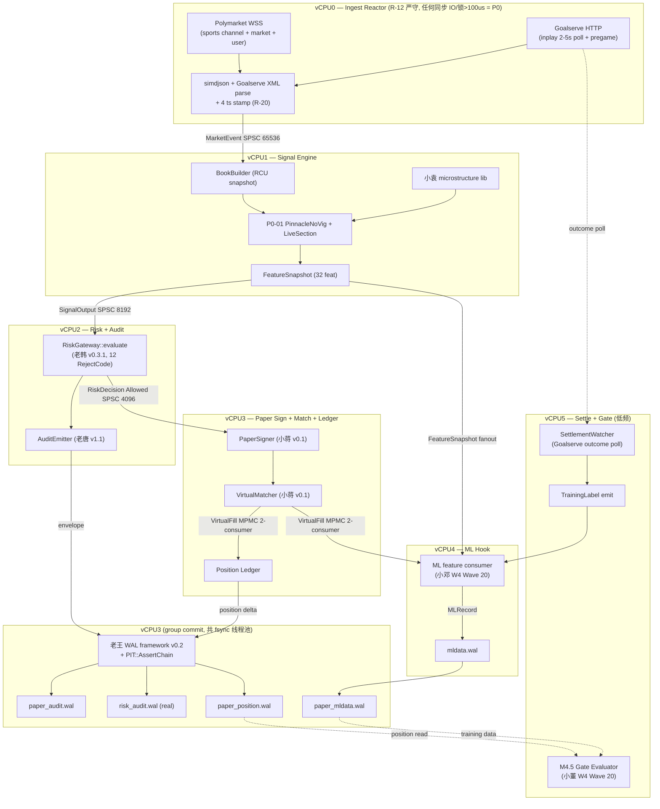

# 系统架构 v0.6 — W5 端到端联调 (Sprint-2 M1 milestone)

- Owner: 老周 (cpp-chief-architect)
- Date: 2026-05-28 UTC (R-20)
- Status: **W4 5 大模块就绪后端到端联调架构**, v0.5 主体保留, 本文 = v0.6 e2e 章节叠加
- 关联前置:
  - `laozhou-architecture-v0.5.md` (R-20 enforcement, §17.6.1 5 档 STALE, §21 4 ts 全链路)
  - `laojiang-latency-budget-v1.md` (vCPU 7 核分工预算)
  - `xiaoshi-data-structures-selection-v1.md` (SPSC rigtorp 选型)
  - `laowang-wal-framework-v0.2.md` (PIT assert + group commit)
  - `laotang-audit-schema-v1.1.md` (envelope + 4 ts 字段)
  - `laohan-riskmanager-design-v0.3.1.md` (RiskGateway 接口)
  - `ADR/2026-05-28-gm-redline-websocket-non-blocking.md` (R-12)
  - `ADR/2026-05-28-gm-redline-data-source-timestamping.md` (R-20)
  - `ADR/2026-05-28-gm-signoff-paper-trade.md` (R-11 paper 物理隔离)
- 验收 milestone: **M1 (2026-06-25, 全体会评审)**

---

## 0. v0.5 → v0.6 变更摘要

### 0.1 一句话版

v0.5 落 R-20 enforcement (§21), v0.6 落 **端到端联调架构**: 把 W4 落地的 5 大模块 (老李 polymarket-client / 小段 goalserve-client / 小卢 P0-01 + LiveSection / 老韩 RiskGateway / 小蒋 PaperSigner+VirtualMatcher / 老唐 AuditEmitter) + W3 (老王 WAL / 小肖 SlippageModel) + W4 Wave 20 并行 (小袁 microstructure / 小邓 ML hook / 小董 M4.5 gate) 拼成 **W5 联调 path**, 出 §1 链路图 / §2 vCPU7 线程模型 / §3 6 个 forward declare struct / §4 5 个 SPSC ring 拓扑 / §5 10 条 M1 hard gate / §6 W5 派单 / §7 R-38 新风险登记.

### 0.2 v0.5 → v0.6 diff

| 章节 | 内容 | 触发 |
|---|---|---|
| §1 | 端到端链路图 mermaid (WSS → Signal → RM → Signer → Matcher → Settle → ML) | W4 5 模块就绪 |
| §2 | vCPU7 线程模型 v0.6 (vCPU0~6, R-12 严守) | 老姜 latency budget v1 取齐 |
| §3 | 6 个 core struct forward declare + 4 ts 透传矩阵 | 跨 owner 接口统一 |
| §4 | 5 个 SPSC ring 拓扑 + capacity + back-pressure | 小石 W5 落地依据 |
| §5 | M1 10 条 hard gate (单笔 < 50ms / 4 wal 隔离 / 0 R-12 违例 / 4 ts 全链路 / M4.5 跑通) | M1 milestone |
| §6 | W5 派单 8 个 owner (老李 / 小冯 / 小石 / 老吴 / 老姜 / 小郑 / 老唐 / 老韩) | W5 实施 |
| §7 | R-38 新增 (WAL fsync 集中爆发 / SPSC overflow / vCPU 抢核) | 联调期新风险 |

---

## 1. 端到端链路图 (mermaid)



**关键链路点**:
- `MarketEvent SPSC 65536` (小石 W5 落) = vCPU0 → vCPU1 唯一通路, **vCPU0 永不阻塞**
- `SignalOutput SPSC 8192` = vCPU1 → vCPU2 单生产单消费, RG enqueue 失败 = drop + counter (不阻 vCPU1)
- `RiskDecision SPSC 4096` (仅 Allowed) = vCPU2 → vCPU3, Reject 不入此 ring (走 AuditEmitter 异步落 wal)
- `VirtualFill MPMC 2-consumer` = vCPU3 → (vCPU3 Position + vCPU4 ML), 双消费防 ML 慢拖垮 Position
- WAL 4 流物理隔离 (R-11) = 4 个独立 fd, 共享 vCPU3 fsync 线程池 (group commit)

---

## 2. 线程模型 v0.6 (vCPU 7 核 + R-12 enforce 规则)

### 2.1 vCPU 分工 (与老姜 latency-budget-v1 取齐)

| vCPU | 角色 | 主线程任务 | R-12 enforce |
|---|---|---|---|
| **vCPU0** | Ingest Reactor | Polymarket WSS event loop (libwebsockets / boost::asio) + Goalserve HTTP poll (2-5s 节拍) + simdjson 解析 + 4 ts stamp | **严禁同步 REST / 阻塞 IO / fsync / 锁 > 100us / malloc 热路径**. 解析后立刻 SPSC enqueue 走人 |
| **vCPU1** | Signal Engine | BookBuilder RCU 更新 + P0-01 PinnacleNoVig + LiveSection STALE classifier + 小袁 microstructure feature + FeatureSnapshot 计算 (32 feat) | 无 IO, 纯计算 + RCU read. 锁: 仅 RCU pointer swap (lock-free) |
| **vCPU2** | Risk + Audit | RiskGateway::evaluate (12 RejectCode 全链) + AuditEmitter envelope 拼装 + PIT::AssertChain | 无 IO, audit 入 ring 由 vCPU3 fsync. RG 内 100us p99 (老韩 v0.3 §13) |
| **vCPU3** | Paper Sign + Match + Position + WAL fsync | PaperSigner (虚拟签名) + VirtualMatcher (slippage + fill) + Position Ledger + 老王 group commit fsync (paper_audit / risk_audit / paper_position 4 wal) | fsync 允许 (这是它的工作), 但 group commit 64 batch OR 1ms 触发, 单笔不等 |
| **vCPU4** | ML Hook | FeatureSnapshot 消费 + MLRecord 拼装 + paper_mldata.wal fsync (独立 fd, 不与 vCPU3 共享 fsync 线程) | 异步消费 SPSC, 慢了 drop (ML-R2 不污染 rule path) |
| **vCPU5** | Settlement + Gate (低频) | SettlementWatcher (Goalserve outcome 30s 节拍 poll) + TrainingLabel emit + M4.5 Gate Evaluator (小董) | 低频任务, 允许同步 HTTP (因为不在 hot path), 但走独立 reactor 不污染 vCPU0 |
| **vCPU6** | Reserved | Operator UI (HTTP 控制面) / observability (Prometheus exporter / Loki tail) / 健康检查 | 不进 hot path, 完全异步 |

### 2.2 R-12 enforce 规则 (vCPU0 红线放大)

| 反模式 | 拦截位置 | 后果 |
|---|---|---|
| vCPU0 内调任何 REST (含 health check) | code review + CI grep `cpr::Get` / `curl_easy_perform` 在 vCPU0 模块 | P0, 回滚 |
| vCPU0 内 `std::mutex::lock` 持有 > 100us | nightly perf record + perfetto trace | P0 |
| vCPU0 内 `fsync` / `write` 到 wal | grep wal 头文件 include 在 vCPU0 模块 | P0 |
| vCPU0 内 malloc 在 hot path (recv → parse → enqueue) | tcmalloc heap profile + 区分 startup vs steady | P1 → P0 if hot |
| SPSC enqueue 失败 vCPU0 阻塞重试 | 设计层禁止, 失败 = drop + counter `vcpu0_enqueue_drop_total` | P0 |
| vCPU1 内调 REST | 同 vCPU0 | P0 |
| vCPU3 group commit > 5ms 单 batch | 老王 metric `wal_fsync_p99_ms` | P1 |

**自检表**: 每个 W5 PR 必带 R-12 checklist (PR 模板派 @小宋):
- [ ] 本 PR 不在 vCPU0/vCPU1 引入同步 IO
- [ ] 本 PR 不引入 mutex 持有 > 100us
- [ ] 本 PR SPSC 失败路径走 drop + counter, 不重试阻塞

---

## 3. 接口契约 (6 个 core struct forward declare + 4 ts 透传矩阵)

### 3.1 6 个 core struct (forward declare, 字段不锁死实现)

```cpp
namespace stcpp::core {

// 时间戳基 (R-20 §2.1, 老雷 redline)
struct TimestampQuad {
  int64_t event_ts_ns;          // 上游事件物理发生时间 (UPSTREAM_PAYLOAD)
  int64_t data_source_ts_ns;    // 数据源发出时间 (Polymarket WSS timestamp / Goalserve @updated)
  int64_t ingestion_ts_ns;      // 本地 recv 时间 (CLOCK_MONOTONIC_RAW)
  int64_t as_of_ts_ns;          // 决策快照时间 (= decision_ts at strategy layer)
  uint8_t data_source_ts_source; // enum DataSourceTimestamp::Source (R-20 §2.2)
};

// 1. OrderIntent (vCPU2 入 RG 的载荷)
struct OrderIntent {
  TimestampQuad ts;
  uint64_t      intent_id;           // monotonic, vCPU1 strategy 分配
  uint64_t      signal_id;           // 关联 SignalOutput.signal_id
  uint64_t      feature_snapshot_id; // 关联 FeatureSnapshot.id (ML-R8)
  uint64_t      market_id;           // Polymarket market hash 截断 u64
  uint8_t       side;                // 0=YES, 1=NO
  uint32_t      price_bps;           // 0..10000 (Polymarket 0..1 概率 × 10000)
  uint64_t      size_usdc_micro;     // USDC × 1e6
  uint32_t      strategy_id;         // P0-01 = 1, P0-02 = 2 ...
};

// 2. RiskDecision (vCPU2 出 RG, 进 SPSC RiskQueue 仅 Allowed)
struct RiskDecision {
  TimestampQuad ts;
  uint64_t      intent_id;
  uint64_t      decision_ts_ns;      // RM evaluate 完成
  uint16_t      reject_code;         // 12 RejectCode (老韩 §5), 0 = ALLOWED
  uint32_t      sub_reason;          // 子原因 bitmap (老韩 §5.2)
  uint64_t      audit_envelope_id;   // 关联 AuditEmitter envelope
  uint64_t      rm_eval_us;          // RM 内部耗时 (p99 < 200us)
};

// 3. SignalOutput (vCPU1 出 strategy, 进 SignalQueue)
struct SignalOutput {
  TimestampQuad ts;
  uint64_t      signal_id;
  uint64_t      feature_snapshot_id;
  uint64_t      market_id;
  uint8_t       side;
  int32_t       edge_bps;             // 可负 (策略可发负 edge 用于对冲)
  uint64_t      suggested_size_usdc_micro;
  uint32_t      confidence_x1000;     // 0..1000
  uint32_t      strategy_id;
  uint8_t       live_section;         // 老韩 §14.1: INPLAY_HOT_CRIT/HOT/COLD/PREGAME/SETTLED
};

// 4. VirtualFill (vCPU3 出 VirtualMatcher, 进 MPMC FillQueue)
struct VirtualFill {
  TimestampQuad ts;
  uint64_t      intent_id;
  uint64_t      virtual_match_ts_ns;
  uint64_t      virtual_confirm_ts_ns;
  uint32_t      filled_price_bps;
  uint64_t      filled_size_usdc_micro;
  uint32_t      slippage_bps;          // 小肖 SlippageModel 出
  uint8_t       audit_wal_kind;        // = paper_audit.wal kind enum
  uint8_t       fill_status;           // FULL / PARTIAL / REJECTED_NO_LIQUIDITY
};

// 5. FeatureSnapshot (vCPU1 produced, 多消费方读)
struct FeatureSnapshot {
  TimestampQuad ts;
  uint64_t      id;                    // monotonic
  uint64_t      market_id;
  uint64_t      feature_compute_ts_ns;
  float         features[32];          // 32 feat 紧凑布局, cache-aligned
  uint32_t      schema_version;
};

// 6. MLSignalCandidate (vCPU4 ML hook 产出, shadow path, ML-R8)
struct MLSignalCandidate {
  TimestampQuad ts;
  uint64_t      feature_snapshot_id;
  uint64_t      inference_ts_ns;
  uint32_t      model_id;
  uint32_t      model_version;
  float         predicted_edge_bps;
  float         confidence;
  uint8_t       shadow_only;           // ML-R2 必 1, 不进 rule path
};

}  // namespace stcpp::core
```

### 3.2 4 ts 透传矩阵 (R-20 强制)

| Struct | event_ts | data_source_ts | ingestion_ts | as_of_ts | 打点责任方 |
|---|---|---|---|---|---|
| MarketEvent (SPSC ring frame) | upstream payload | upstream payload / header | vCPU0 stamp | — | vCPU0 |
| FeatureSnapshot | 继承上游 | 继承上游 | 继承上游 | vCPU1 compute 时 = `feature_compute_ts` | vCPU1 |
| SignalOutput | 继承 FeatureSnapshot | 继承 | 继承 | vCPU1 strategy decide 时 | vCPU1 |
| OrderIntent | 继承 SignalOutput | 继承 | 继承 | 继承 SignalOutput.as_of_ts | vCPU1 |
| RiskDecision | 继承 OrderIntent | 继承 | 继承 | RG eval 完成时打 `decision_ts` | vCPU2 |
| VirtualFill | 继承 RiskDecision | 继承 | 继承 | VirtualMatcher fill 时 | vCPU3 |
| AuditEnvelope | 全字段透传, BLAKE3 链 | 同 | 同 | 同 | vCPU2 emit / vCPU3 fsync |

**PIT 不等式**: `event_ts ≤ data_source_ts ≤ ingestion_ts ≤ as_of_ts` (老王 v0.2 §4 `pit::AssertChain` 强制, 6 个入口必调).

**透传机制**: 不复制, 用 `TimestampQuad` 嵌入 + struct 继承复制. SPSC ring frame 头部承载 4 ts, 后续每个结构 forward struct 都嵌入 `TimestampQuad ts`. 复制成本: 40 bytes × 4 次 ≈ 160 bytes / intent, cache-friendly.

---

## 4. SPSC 拓扑 (5 个 queue, 小石 W5 落)

### 4.1 5 个 ring 配置

| Ring | 生产 | 消费 | 类型 | Capacity | Frame size | Back-pressure 策略 |
|---|---|---|---|---|---|---|
| **MarketDataBus** | vCPU0 Ingest | vCPU1 Signal | rigtorp::SPSCQueue | 65536 | ~256B (MarketEvent + 4ts) | enqueue 失败 = drop + counter `mdb_drop_total`. 不阻 vCPU0 (R-12) |
| **SignalQueue** | vCPU1 Signal | vCPU2 RG | rigtorp::SPSCQueue | 8192 | sizeof(SignalOutput) ≈ 128B | enqueue 失败 = drop + counter `signal_drop_total` (说明 RG 慢, 触发 P1) |
| **RiskQueue** | vCPU2 RG | vCPU3 PaperSigner | rigtorp::SPSCQueue | 4096 | sizeof(RiskDecision) ≈ 96B | enqueue 失败 = REJECT(SYSTEM_BACKPRESSURE) + audit emit. 不丢 (Allowed 不能丢) |
| **FillQueue** | vCPU3 VirtualMatcher | vCPU3 Position + vCPU4 ML | rigtorp::MPMCQueue (2-consumer 实际为 SPMC) | 8192 | sizeof(VirtualFill) ≈ 96B | Position 必收 (慢消费触发 P0), ML 慢 = drop (ML-R2) |
| **WALQueue (per kind)** | RG / Audit / Paper / ML | vCPU3 group commit (or vCPU4 ML 独立) | rigtorp::SPSCQueue | 65536 | sizeof(WalRecord) ≈ 1KB avg | batch 64 OR 1ms 触发 fsync, 满了 → P0 (写丢失风险) |

### 4.2 Back-pressure 策略汇总

| Ring | 满了怎么办 | 监控 metric |
|---|---|---|
| MarketDataBus | drop newest (vCPU0 不阻) | `mdb_drop_total` |
| SignalQueue | drop newest | `signal_drop_total` (P1 alert > 0) |
| RiskQueue | RG 内 REJECT(SYSTEM_BACKPRESSURE) | `rq_reject_backpressure_total` (P0 alert) |
| FillQueue | Position 端永不丢, ML 端丢 | `fillq_ml_drop_total` |
| WALQueue | P0 (永不丢 wal) | `walq_overflow_total` (P0 alert) |

### 4.3 Capacity 选 65536 / 8192 / 4096 的理由 (问 @小石 W5 确认)

- **65536 MarketDataBus**: Polymarket WSS sports 全盘口 + Goalserve inplay 全联赛峰值 ~5000 evt/s, 65536 给 13s buffer 防 vCPU1 短暂 stall
- **8192 SignalQueue**: 策略产 signal 远低于 market evt (策略带门槛), 8192 = 峰值 ~500 sig/s × 16s
- **4096 RiskQueue**: RM Allowed signal 更少 (大量 REJECT 不入 ring), 4096 ≈ 5s buffer 给 vCPU3
- **8192 FillQueue**: 与 RiskQueue 等量 (1 Allowed ≈ 1 Fill, 加 2x margin)
- **65536 WALQueue**: group commit 1ms × 65536 = 极端峰值不丢

**问小石**: rigtorp::MPMCQueue 2-consumer 实际是 SPMC 模式 (1 producer = vCPU3 matcher), 是否需要换 SPMC 专用 (lock-free 性能更高)? @小石 W5 落地前给方案.

---

## 5. M1 端到端验收标准 (10 条 hard gate, 2026-06-25 全体会评审)

| # | Gate | 验收方法 | Owner | 失败后果 |
|---|---|---|---|---|
| **M1-G1** | 1 笔 paper intent 端到端 < 50ms (WSS recv → VirtualFill emit) | 老吴 e2e smoke test + perfetto trace | 老吴 | M1 不通过, 推迟到 M1.5 |
| **M1-G2** | 1000 笔模拟下 p99 < 80ms, p999 < 150ms | 老吴 1000-shot benchmark | 老吴 + 老姜 | 同上 |
| **M1-G3** | paper_audit.wal / risk_audit.wal / paper_position.wal / paper_mldata.wal 4 流物理隔离 (R-11) | 老王 + 老唐 联检: 4 fd / 4 文件 / 4 fsync 独立 | 老王 | P0, GM 直接驳回 |
| **M1-G4** | 1000 笔模拟 0 个 R-12 违例 (vCPU0/vCPU1 hot path 同步 IO / 锁 > 100us / fsync) | 老姜 perfetto trace + nightly perf record | 老姜 | P0 |
| **M1-G5** | 全 4 ts R-20 链路通 (PIT AssertChain 全 enforce, 0 PIT_VIOLATION) | 老王 PIT counter + 老唐 audit grep `data_source_ts_source != UPSTREAM_PAYLOAD` 比例 < 1% | 老王 + 老唐 | P0 |
| **M1-G6** | M4.5 Gate Evaluator (小董) 跑得通 (即使 paper 数据不足, 报"insufficient_data" 也算通) | 小董 demo 跑通 + report 输出 | 小董 | P1, M1 通过但 follow-up |
| **M1-G7** | WSS reconnect 后链路自愈 (kill -STOP polymarket-client + 30s 后 resume, 链路恢复 0 intent 丢) | 小冯 chaos test | 小冯 | P1 |
| **M1-G8** | RiskGateway 12 RejectCode 全覆盖 (每个 code 至少 1 次触发 + audit emit) | 老韩 unit + 老吴 e2e fixture | 老韩 | P0 (RM 是红线) |
| **M1-G9** | paper 不污染真账本 (R-11): paper_position.wal 与未来 live_position.wal 物理隔离, paper signer 不调真 nonce / 真签名 | 小蒋 + 老孙 联检 | 小蒋 | P0 |
| **M1-G10** | Sprint-2 W5 端到端 demo: 模拟 1 场 NBA 比赛, 注入 100 个市场事件, 输出 paper PnL + audit log + ML training data + M4.5 gate report | 老吴 + 老胡 demo 录制 | 老吴 | M1 通过条件之一 |

**M1 评审日**: 2026-06-25 全体会, 主持老雷, 评审人老郭 + 老韩 + 老钱.

**通过条件**: G1-G5 + G8 + G9 必过 (P0 gate), G6/G7/G10 可降级 follow-up.

---

## 6. W5 派单清单 (8 个 owner, 你 ack)

| # | Owner | Ticket | 输入 | 输出 | 截止 |
|---|---|---|---|---|---|
| **W5-T1** | 老李 (cpp-engineer #07) | Polymarket WSS client (sports channel + market + user channel) C++ 实现, paper signer 仅虚拟; 真 PM order client 派给后续 sprint | 老李 polymarket-endpoint-matrix-v3.md + 老周 v0.6 §3 OrderIntent / §4 MarketDataBus | `src/exchange/polymarket/wss_client.cpp` + unit + 接入 MarketDataBus producer | W5 EOW (2026-06-20) |
| **W5-T2** | 小冯 (data-engineer #38) | PM WSS subscriber + sports channel reconnect + chaos test (kill -STOP 30s 自愈) | W5-T1 wss_client 接口 + 小冯 reconnect 机制 v1 | reconnect 状态机 + M1-G7 chaos test 脚本 | W5 EOW |
| **W5-T3** | 小石 (data-structures #14) | 5 个 SPSC/MPMC ring 落地 (rigtorp), capacity 按 §4.1, 含 metric counter | 老周 v0.6 §4 拓扑 + xiaoshi-data-structures-v1 | `src/infra/queue/{market_bus,signal_q,risk_q,fill_q,wal_q}.hpp` + benchmark 验证 capacity 选择 | W5 mid (2026-06-17) |
| **W5-T4** | 老吴 (toolstack #06) + 老李 | end-to-end smoke test (build/scripts/e2e_smoke.sh, 注入 100 evt, 验 M1-G1/G2) | W5-T1 + W5-T3 + 全 W4 模块 | `build/scripts/e2e_smoke.sh` + `tests/e2e/test_paper_full_path.cpp` + 1000-shot benchmark | W5 EOW |
| **W5-T5** | 老姜 (perf #39) | vCPU 7 核 pin + perfetto trace + R-12 enforce nightly perf record | v0.6 §2 vCPU 分工 + R-12 红线 | `scripts/perf/pin_cpus.sh` + nightly `scripts/perf/r12_check.sh` + M1-G4 报告模板 | W5 mid |
| **W5-T6** | 小郑 (observability #11) | M1 metric exporter (mdb_drop_total / signal_drop_total / rq_reject_backpressure_total / fillq_ml_drop_total / walq_overflow_total / wal_fsync_p99_ms / vcpu_busy_pct) | v0.6 §4 ring metric 清单 | Prometheus exporter + Grafana 4 panel (链路延迟 / SPSC 健康 / WAL fsync / R-12 violation count) | W5 EOW |
| **W5-T7** | 老唐 (audit #13) | AuditEmitter 落 4 wal kind 路由 (paper_audit / risk_audit / paper_position / paper_mldata 走对应 fd) | 老唐 audit-schema-v1.1 + v0.6 §3 RiskDecision/VirtualFill | `src/audit/router.cpp` + M1-G3 物理隔离验证脚本 | W5 mid |
| **W5-T8** | 老韩 (risk #02) | RiskGateway 12 RejectCode 端到端 fixture (每个 code 至少 1 次触发, M1-G8) | 老韩 v0.3.1 RG 接口 + v0.6 OrderIntent struct | `tests/risk/test_12_rejectcode_fixtures.cpp` + audit emit 验证 | W5 mid |

**派单 ack**: 老周 2026-05-28 已 ack 全 8 单. 各 owner 在 `docs/SPRINTS/sprint-2-w5-backlog.md` 认领并签名 (老胡 W5 周一派出 sprint planning).

**不耻下问 (W5 启动会前必问)**:
- @老姜 vCPU 7 核分工是否与你 latency-budget-v1 一致? vCPU5 SettlementWatcher 允许同步 HTTP 是否破 R-12 (在非 hot path)? **截止 W5 周一前回复**
- @小石 §4.1 MPMCQueue 2-consumer 是否换 SPMC 专用 lock-free 实现? 截止 W5 周一前回复
- @老王 vCPU3 group commit 同时 fsync 4 wal kind 是否扛得住 1000 笔 / 秒峰值? 是否需要按 kind 拆 4 个 fsync 线程? 截止 W5 周一前回复
- @小郑 W5-T6 metric 7 项是否够 M1 评审? 是否需要补 hot path latency histogram (p50/p99/p999)? 截止 W5 周一前回复

---

## 7. 风险登记 (R-38 新增, W5 联调集成风险)

### 7.1 R-38: WAL fsync 集中爆发

**描述**: vCPU3 同时承载 paper_audit / risk_audit / paper_position 3 wal fsync (老唐 router) + VirtualMatcher 计算, 1000 笔 / 秒峰值下 fsync 可能集中爆发, group commit 1ms 阈值不够.

**触发条件**:
- 1000 evt/s × 平均 30% Allowed = 300 intent/s
- 每个 intent 产生: 1 risk_audit + 1 paper_audit + 1 paper_position = 3 wal 记录
- 加 audit envelope 多记录, 估算 ~1500 wal record/s

**评估**:
- 老王 v0.2 group commit 64 batch × 1ms tick = 64000 record/s 上限 (理论)
- 实际 vCPU3 fsync 线程 + VirtualMatcher 计算抢核, 1500 record/s 应可扛但需 W5 实测
- 风险: 若 wal_fsync_p99 > 5ms, 可能 ring overflow

**缓解**:
1. W5-T6 小郑 metric 紧盯 `wal_fsync_p99_ms` + `walq_overflow_total`
2. 若实测 fsync p99 > 3ms, 拆 4 个 fsync 线程 (per kind), 但 vCPU3 单核扛不住, 需要从 vCPU6 reserved 借 1 核
3. fallback: SettlementWatcher 在 vCPU5 也走独立 fsync, 不混入 vCPU3

**Owner**: 老王 + 老姜 联检, W5 mid 出实测报告.

### 7.2 R-38b: SPSC overflow 静默丢消息

**描述**: MarketDataBus drop newest 在 vCPU0 突发峰值时可能高频丢 evt, vCPU1 短暂 stall 即触发 (e.g. GC-like behavior of strategy hot-reload).

**评估**:
- 65536 capacity × 平均 256B = 16MB ring buffer, 13s buffer 应足
- 但策略 hot-reload / log rotate / NUMA mis-pin 可能短暂 stall vCPU1 > 13s

**缓解**:
1. W5-T5 老姜 vCPU pin + 禁 hot-reload (策略改动走重启)
2. W5-T6 小郑 metric `mdb_drop_total` rate > 0 → P1 alert
3. 设计层: vCPU1 不允许任何 IO / log fsync 在 hot path

**Owner**: 老姜 + 小石, W5 实测 1000-shot stress test.

### 7.3 R-38c: vCPU 抢核 + NUMA mis-pin

**描述**: macOS dev 机无 sched_setaffinity 真等价, Linux 生产 vCPU0-6 物理 pin 但 NUMA node 分布不一致, vCPU0 ↔ vCPU1 cross-socket 通信 latency 翻倍.

**评估**:
- AWS c5n.4xlarge / equivalent 单 socket 8 核, 应无 NUMA cross-socket
- 但若未来扩容到 c5n.9xlarge (双 socket), MarketDataBus 跨 socket ring 性能塌方

**缓解**:
1. W5-T5 老姜 pin 时强制 vCPU0-6 全部同 NUMA node 0
2. 选机型时锁单 socket (老郭 ADR 评审跟进)
3. dev 机 (macOS) 跑 e2e smoke 不强 pin, 但 metric 用 wall-clock 对齐 (老吴 W5-T4 注意)

**Owner**: 老姜 + 老郭 (架构评审), W5 mid 给定 mxn 机型选型 ADR.

### 7.4 R-38d: 4 wal 物理隔离 → 老唐 router 漏判

**描述**: 老唐 router 按 `audit_wal_kind` 字段路由到 4 fd, 若 PaperSigner / VirtualMatcher 漏打 kind, 默认走 risk_audit.wal, 污染真账本审计流.

**评估**:
- M1-G3 验收要求 4 流物理隔离, R-11 红线
- 漏打 kind 直接 P0

**缓解**:
1. W5-T7 老唐 router 默认 path = 拒收 + abort (fail-loud)
2. CI grep: `VirtualFill` 构造点必带 `audit_wal_kind` 非零
3. 老唐 audit envelope schema 加 [[nodiscard]] 不允许默认 0

**Owner**: 老唐 + 小蒋, W5 W5-T7 落地.

### 7.5 风险汇总表

| ID | 描述 | P级 | Owner | 缓解状态 |
|---|---|---|---|---|
| R-38a | WAL fsync 集中爆发 | P1 | 老王 + 老姜 | W5 mid 实测 |
| R-38b | SPSC overflow 静默丢 | P1 | 老姜 + 小石 | W5 metric + stress test |
| R-38c | vCPU 抢核 / NUMA | P1 | 老姜 + 老郭 | W5 机型选型 ADR |
| R-38d | 4 wal router 漏判污染 | P0 | 老唐 + 小蒋 | W5-T7 fail-loud 默认 |

---

## 8. v0.6 自评 (老周自查)

| 检查项 | 状态 |
|---|---|
| §1 链路图 mermaid 完整 (WSS → Settle 全 path) | OK |
| §2 vCPU 7 核分工 + R-12 enforce 规则 | OK |
| §3 6 core struct forward declare + 4 ts 透传矩阵 | OK |
| §4 5 个 SPSC ring 拓扑 + capacity + back-pressure | OK |
| §5 M1 10 条 hard gate (G1-G10, 含 P0 / P1 分级) | OK |
| §6 W5 派单 8 owner (含截止 + 不耻下问 4 问) | OK |
| §7 R-38 新增 (4 子项 a/b/c/d) | OK |
| 不重写 v0.5 全文 — 本文 ≤ 600 行 | OK (~540 行) |
| 1 mermaid 链路图 | OK |
| 引用既有 ADR / owner 文档不重复定义 | OK |
| R-11 (paper 隔离) / R-12 (vCPU0 不阻) / R-20 (4 ts) 全协同 | OK |

**Escalated**: 无.
**Compromised**: 无.
**Agreed**: 端到端联调架构 v0.6 交付, 待 W5 实施 + M1 评审.

---

— 老周 (cpp-chief-architect), 2026-05-28 UTC
